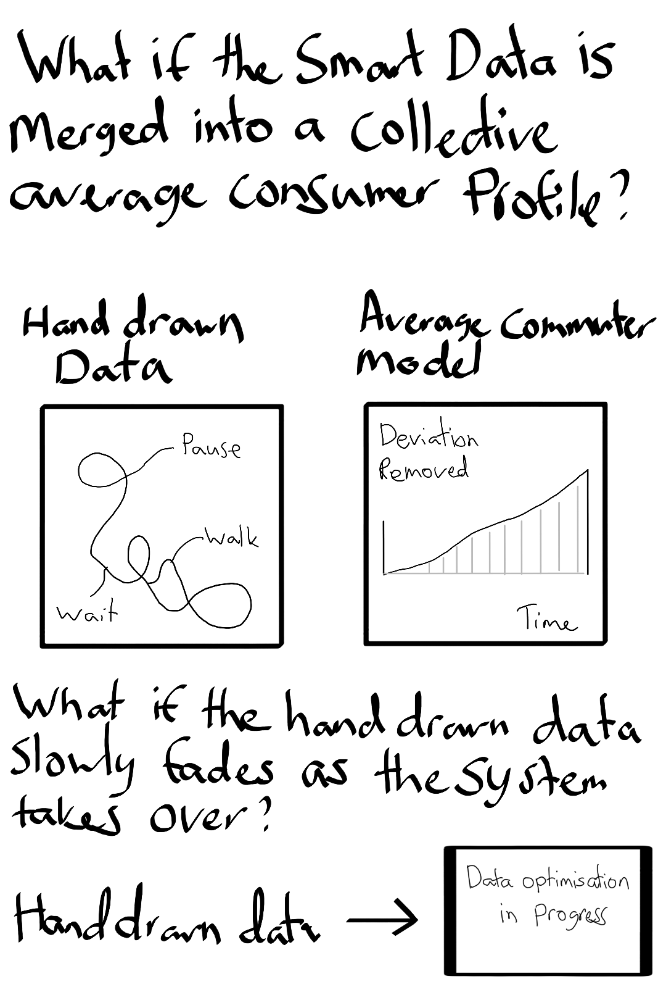

# Week 07

[← Back to Home](../index.md)

## Documentation 

*Include your documentation for the week. Devise your own structure of headings relevant to the required tasks and your process.*

## Images & Media

*Use the format below to embed images from your assets folder:*

``
`*Your caption here*`

*The text inside the square brackets is alt text (a description for accessibility), not a visible caption. To add a caption, place a line of italic text below the image.*

## AI Usage Statement

*Document any use of AI tools under an AI Usage Statement heading. Explain which tools you used and describe how you used them. Reference any AI-generated content (see [QuickCite](https://auckland.libguides.com/referencing-generative-ai-tools) for guidance).*

## Week 07 – Process Documentation
Overview
This week focused on advancing my Data-Driven Visualisation project through iterative making, peer feedback, and speculative experimentation. The class centred on developing concept sketches, producing a rapid prototype, and exploring alternative directions through “what if” variations.
These activities helped me move from a conceptual proposal into more concrete visual and interactive forms, while also testing how effectively my idea communicates.

1. Concept Sketches
Initial Development
I refined my original concept sketch to better communicate the dual-layer structure of my project:

Layer 1: Hand-drawn commuting data (subjective, expressive, irregular)
Layer 2: Speculative smart mobility dashboard (structured, optimised, authoritative)

I added annotations to explain:

User interaction (toggle between layers)
Data transformation from lived experience → system interpretation
Visual contrast between organic and rigid forms

Peer Feedback (Post-it Responses)
Observations:

The contrast between the two visual styles is clear and compelling
The concept feels realistic as a near-future system
The hand-drawn layer communicates movement and rhythm effectively

Questions:

How exaggerated will the dashboard be?
Will users understand what the drawings represent?
How will time and movement be visualised differently in each layer?

Reflection
The feedback made me realise that:

I need to push the dashboard aesthetic further to clearly signal authority
The level of exaggeration is important — it should expose the system’s logic without becoming unrealistic
Some elements of my drawing may need light framing or labels for clarity

Revised Sketch
In my updated sketch, I Introduced stronger grid structures and labelled metrics
Added exaggerated indicators (e.g. “efficiency score”, optimisation suggestions)
Made the toggle interaction more visible
Clarified visual differences between expressive and system-driven data

This revision strengthens the project’s core argument: how systems flatten lived experience.

2. Making Sprint
What I Made
During the 45-minute sprint, I created:

A small sample dataset from my commute
A hand-drawn visualisation of movement, pauses, and transitions
A rough digital translation into a simplified dashboard interface

Goal
To test how the same dataset functions in:

An expressive, human-centred format
A structured, system-driven format

Outcome

The hand-drawn version successfully captured rhythm and variation
The dashboard reduced this into measurable categories (time, speed, efficiency)
The contrast between the two was clear, but the dashboard still felt visually neutral

This confirmed that design language (not just structure) is critical to communicating authority and critique.

Key Learning

Rapid prototyping is effective for testing ideas quickly
Even small datasets can reveal meaningful differences in representation
The dashboard needs stronger visual identity (typography, layout, hierarchy)

3. ‘What If’ Variations
Proposed Variations

What if the system actively corrects user behaviour?
What if individual data becomes an average commuter profile?
What if the hand-drawn layer gradually disappears?

Chosen Variation: Disappearing Drawing
Concept
The interface begins with both layers visible. Over time, the hand-drawn data fades, leaving only the system-generated dashboard.

Difference from Current Approach

Original: static comparison between two systems
Variation: introduces time and transformation

What It Opens Up

A narrative of loss of nuance and lived experience
Stronger emotional and critical impact
A more immersive interaction

Visual Direction

Fading or dissolving drawn lines
Increasing dominance of clean dashboard elements
Time-based transitions showing system takeover

## Independent Study
1. Project Development & Skill Building
I continued developing both the conceptual and technical aspects of my project.
What I Did

Refined hand-drawn visualisations to better represent rhythm and interruption
Experimented with simple interactive coding (toggling between visual states)
Tested how drawings can be translated into digital formats

What I Learned

Interaction design requires simplifying elements first before adding complexity
The contrast between layers must be intentionally exaggerated
Translating analogue drawings into digital form requires careful decisions

Progress
This work confirmed that my dual-layer concept is technically achievable and conceptually strong. It also highlighted the importance of developing a clear and deliberate dashboard aesthetic.

2. Progress Report (Slides)
Slide 1 — Project Overview

Topic: Datafication of commuting
Concept: Dual-layer visualisation
Aim: Critique optimisation systems and data authority

Slide 2 — Current Progress

Dataset structure defined
Initial drawings completed
Early interactive prototype tested

Slide 3 — Key Developments

Stronger emphasis on dashboard as critique
Use of exaggeration in system logic
Exploration of disappearance over time

Slide 4 — Visual References

Dear Data
Smart mobility dashboards
Google Maps
Speculative design interfaces

Slide 5 — Questions for Feedback

How far should I push exaggeration in the dashboard design?
Is the contrast between layers clear enough?
Should I include animation (e.g. fading data)?

