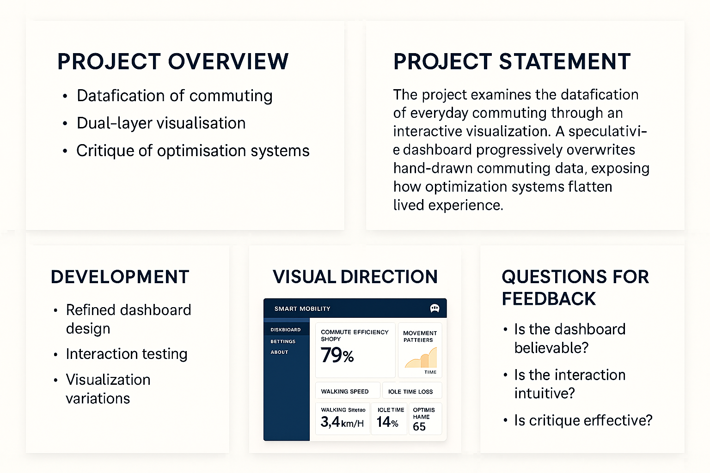
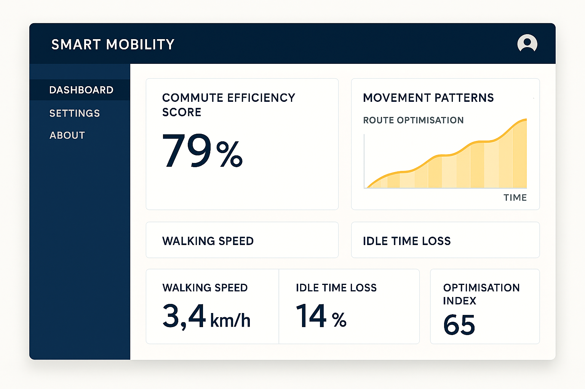

# Week 09

[← Back to Home](../index.md)

## Week 09 – Process Documentation
Overview
This week focused on developing a first draft of my project statement, refining my concept through peer feedback, and continuing hands-on experimentation through a making sprint. The process helped clarify my project’s core argument, visual direction, and intended impact.

1. Project Statement – First Draft
Draft Statement (≈300 words)
This project explores the datafication of everyday commuting through a speculative “smart mobility optimisation” system. In this near-future scenario, urban movement is continuously measured through sensors that track walking speed, waiting time, route choice, and behavioural efficiency. These systems promise smoother transport experiences, but in doing so, they reduce complex, lived movement into simplified, optimised data.
The work is based on a self-collected dataset documenting my own commute over several days. Using a structured observation method, I record actions such as walking, waiting, pausing, and navigating crowded spaces. This dataset remains intentionally subjective, foregrounding the role of interpretation in how data is produced.
The visualisation takes the form of an interactive interface that presents this data in two contrasting ways. The first layer consists of hand-drawn data visualisations that express rhythm, interruption, and embodied experience. The second layer is a speculative dashboard that translates the same data into quantified metrics such as efficiency scores, movement patterns, and optimisation pathways.
By allowing users to toggle between these layers—or experience the gradual disappearance of the hand-drawn data—the project reveals how institutional systems flatten and overwrite situated knowledge. The dashboard aesthetic exaggerates clarity, neutrality, and authority in order to expose its underlying assumptions.
Engaging with ideas of data sovereignty, the project questions who controls data, whose experiences are represented, and what forms of knowledge are lost when everyday life is reduced to measurable units. Ultimately, it argues for the value of ambiguity, context, and human interpretation in understanding how we move through the city.

Evaluation of Draft
What is working well

Clear future scenario (smart mobility system)
Strong contrast between human vs system data
Good link to data sovereignty and critique
Explains both process and output clearly

What is missing / underdeveloped

Could specify user interaction more concretely
Emotional impact could be slightly stronger
Dashboard aesthetics could be described more visually

What feels too general

“Raises questions about data” → too broad
Could be more precise about how users experience the system

What I need to research further

Examples of real smart mobility dashboards
UI design strategies that signal institutional authority
Methods for encoding ambiguity visually

Commitment Sentence
I will develop an interactive, dual-layer visualisation where a speculative dashboard progressively overwrites hand-drawn commuting data to reveal how optimisation systems erase lived experience.

Peer Feedback (Project Statement Sharing)
What was clear and compelling

Strong idea of methodology as critique
Dual-layer system is easy to understand
Disappearing drawing concept is powerful

What needs development

Make interaction more explicit
Clarify visual style of dashboard
Push emotional/experiential impact

2. Making Sprint
Sprint Plan
Goal:
Test how the dashboard aesthetic communicates authority
Focus:

Layout structure
Metric design
Visual hierarchy

What I Made

A refined dashboard mockup layout
Metrics such as:

“Commute Efficiency Score”
“Route Optimisation Index”
“Idle Time Loss (%)”

Overlay test with hand-drawn data

Outcome

Dashboard feels more “real” when:

Clean grids are used
Labels are technical and specific
Numbers are prominent

Still needs:

Stronger visual identity (colour, typography)
More contrast with drawing layer

Key Learning

Authority comes from consistency + structure, not complexity
Small UI details (labels, spacing, alignment) matter
The system must feel believable before it can be critiqued

3. Round Robin Rapid Reactions
Visitor Feedback
On project statement:

Provocation is clear but could be more direct
Strong concept, but interaction needs clarity

On making sprint output:

Dashboard is becoming convincing
Needs stronger contrast with drawing

Emotional/critical response:

Makes people think about surveillance and control
Feels slightly dystopian but still plausible

What needs resolving before Week 12

Final interaction design
Visual consistency
How users “read” the drawing

Key Insights

My project works best when it feels real but slightly exaggerated
Interaction is key to making the critique effective
The visual language of authority must be intentional

## Independent Study
1. Project Development
What I did

Refined dashboard interface further
Tested fading/overlay transitions
Experimented with UI language and system tone

What I tried

Adding system-like labels (e.g. “Optimisation Active”)
Structuring interface like real dashboards
Testing gradual disappearance of drawings

What I learned

The system voice (text + labels) shapes interpretation
Transitions add narrative, not just interaction
Contrast must be visually and conceptually clear

Progress

Stronger connection between concept + execution
Moving toward a clear final artefact
More confidence in direction

2. Next Progress Report (Slides)
Slide 1 — Overview

Project concept (dual-layer commuting visualisation)

Slide 2 — Project Statement (draft)
Slide 3 — Development

Dashboard refinement
Interaction testing
Variation exploration

Slide 4 — Visual Direction

Hand-drawn vs system UI
References

Slide 5 — Questions

Is the dashboard believable enough?
Is the interaction clear?
Does the critique feel too subtle or too obvious?

