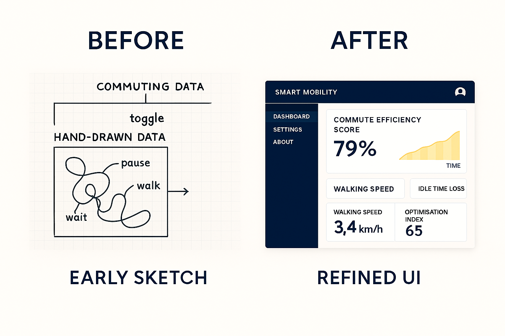

# Week 10

[← Back to Home](../index.md)

## Week 10 – Process Documentation
Overview
This week focused on presenting my near-final project, gathering structured peer feedback through the Padlet system, and refining my direction through a clear action plan. The session helped clarify what aspects of my project are working effectively and what needs to be resolved before the Week 12 showcase.

1. Progress Report & Feedback
Presentation Summary
I presented my project as an interactive dual-layer visualisation of commuting data:

A hand-drawn layer representing lived, subjective experience
A speculative smart mobility dashboard representing system-controlled data

I also showed:

My refined dashboard UI mockup
The “disappearing drawing” transition
Early interaction ideas

Feedback Received (Padlet + Discussion)
Conceptual Feedback

The critique of datafication and optimisation is clear and strong
The “disappearing drawing” is the most powerful part of the project
The idea of data sovereignty could be made more visible in the interface

Technical Feedback

The dashboard UI looks convincing but needs:

More consistent typography
Clearer hierarchy between elements

The interaction needs to be:

Simple and intuitive
Strongly connected to the concept

Experience Feedback

Viewers want to understand the hand-drawn data more easily
The transition should feel more intentional and noticeable
The project should guide the viewer slightly more

Gallery Walk Insights
From reviewing other groups:

Strong projects used clear visual systems + strong concepts together
Simpler interactions often worked better than complex ones
Visual clarity is key to communicating critique

This reinforced the need to refine my interface rather than overcomplicate it.

2. Action Plan (Reflective Summary)
The most significant feedback I received highlighted the importance of refining the clarity, consistency, and interaction design of my project. While the core concept—the contrast between hand-drawn commuting data and a speculative smart mobility dashboard—is strong and clearly understood, the effectiveness of the work now depends on its execution. In particular, the “disappearing drawing” transition was consistently identified as the most compelling element, suggesting that I should prioritise developing this into a central feature rather than treating it as an optional variation.
Another key point was the need to improve the readability of the hand-drawn layer. While ambiguity is important to the project’s critique, viewers still need a point of entry to engage with the data. I will address this by adding subtle annotations or framing elements that support interpretation without removing its expressive quality.
From a technical perspective, I need to refine the dashboard interface to ensure consistency in layout, typography, and hierarchy. This will help the system feel more believable and authoritative, which is essential for the critique to work.
Moving forward, my focus will be on simplifying the interaction, strengthening the visual contrast between layers, and refining the transition between them. These changes will ensure that the project clearly communicates its argument while remaining engaging and accessible to viewers.

## Independent Study – Project Development
What I Worked On

Refined dashboard UI (alignment, spacing, labels)
Improved hand-drawn visual clarity
Tested animation/transition ideas
Integrated feedback into interaction design

What I Tried

Simplifying the interface layout
Making the fade/disappearance more gradual and controlled
Adding light labels to hand-drawn data
Strengthening colour contrast between layers

What I Learned

Strong projects depend on clarity, not complexity
Interaction should reinforce the concept, not distract from it
Visual consistency makes systems feel believable
Transitions can carry meaning, not just aesthetics

How This Moves My Project Forward

My project now has a clear final direction
The key feature (disappearing data) is defined
The visual system is more consistent and controlled
I am ready to focus on final refinement and polish for Week 12

